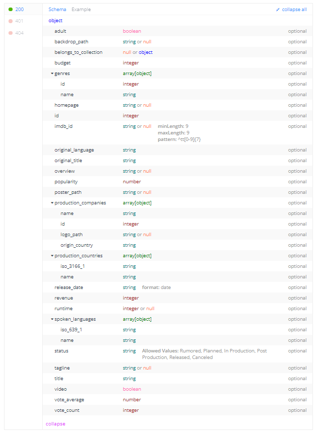

# TMDB

## Prerequisites

* [node + npm](https://nodejs.org/) (Current Version)
* [Docker](https://docs.docker.com/engine/install/) & [Docker Compose](https://docs.docker.com/compose/install/)

## Includes the following

* Javascript, TypeScript
* NodeJs (Backend)
* React, NextJs (Front-end)
* MySQL (Database)
* RabbitMQ
* Redis
* [Assets server](https://www.themoviedb.org/)

## Project Structure

* `client`: 
  * Interact with user, showing all the movies and allow user to search and see the detail for the movie they want to see.
  * The technology behind are ReactJS and NextJS. The main feature is showing the dynamic movie is build on the client side with React, which help the elements are rendered faster with the partial render
  * NextJS structure allow a clean view for the directory tree, and allow to switch to SSR to enhance the SEO ability.  
---
* `server`: Contain the main logic for reading data, serve as a reader and connect directly with client side, trigger background job to crawl the data.
---
* `worker`: Taking the action for the background job, fetching the data and serve as a writer node, helps improve performance for the main server.
---
* `message-queue`: Guarantee that the worker takes the job sequentially.
---
* `mysql`: The database for the application.
    * Data structure:
      
---
* `redis`: Caching the request, which helps the popular movie can access as fast as possible and improve performance for the database.

## Setup
* Install dependencies for Back-end. Open terminal in `server` folder, run below command:
> npm install

* Install dependencies for Front-end. Open terminal in `client` folder, run below command:
> npm install

* Install dependencies for Front-end. Open terminal in `worker` folder, run below command:
> npm install

## Run: 2 ways
1. Docker Compose: Because this project needs to use `RabbitMQ`, `Redis` and `MySQL`,
  we need to launch these services via docker-compose.

  * Open terminal in root folder and run the command below:
  > docker-compose build && docker-compose up -d
  * Run the modules:
    * Run `worker`: go to the `worker` folder and run the command:
    > npm run start
    * Run `server`: go to the `server` folder and run the command:
    > npm run start
    * Run `client`: go to the `client` folder and run the command:
    > npm run start

2. Run the Docker Compose staging:
    * Open terminal in root folder and run the command below:
    > docker-compose -f docker-compose-stg.yml build && docker-compose -f docker-compose-stg.yml up -d

_Ports_:
* `3000`: [client](http://localhost:3000)
* `8080`: [server](http://localhost:8080)
* `8081`: [worker](http://localhost:8081)
* `3306`: MySQL
* `5672` `15672`: RabbitMQ
* `6379`: Redis

