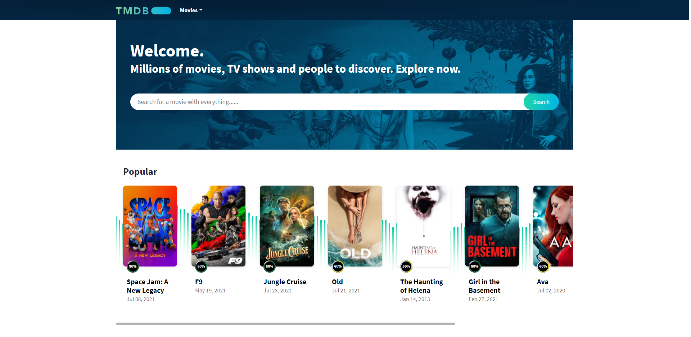

# TMDB

This is my 36-hour coding challenge. The topic is:
- Create A Movies List App using React.js And Node.js for API.
- Consume TMDb API in Node.js for Data. [https://www.themoviedb.org/documentation/api/discover](https://www.themoviedb.org/documentation/api/discover)
- Show Movies List Page With Tab for Latest & Popular and Movie Detail Page.
- Create a middleware in Node.js for Logging.
- For List Design Reference - [https://www.themoviedb.org/?language=en-US](https://www.themoviedb.org/?language=en-US) , And For Details Page Designs Reference - [https://www.themoviedb.org/movie/181812-star-wars-the-rise-of-skywalker?language=en-US](https://www.themoviedb.org/movie/181812-star-wars-the-rise-of-skywalker?language=en-US).
- Store Movies Data in SQL DB and add logic to refresh data once per day.
- You can go for minimal design due to the time concern, but it should look nice.

## Prerequisites

* [node + npm](https://nodejs.org/) (Current Version)
* [Docker](https://docs.docker.com/engine/install/) & [Docker Compose](https://docs.docker.com/compose/install/)

## Includes the following

* Javascript, TypeScript
* NodeJs (Backend)
* React, NextJs (Front-end)
* MySQL (Database)
* RabbitMQ
* Redis
* [Assets server](https://www.themoviedb.org/)

## Project Structure

* `client`: 
  * Interact with user, showing all the movies and allow user to search and see the detail for the movie they want to see.
  * The technology behind are ReactJS and NextJS. The main feature is showing the dynamic movie is build on the client side with React, which help the elements are rendered faster with the partial render
  * NextJS structure allow a clean view for the directory tree, and allow to switch to SSR to enhance the SEO ability.  
---
* `server`: 
  * Contain the main logic for reading data, serve as a reader and connect directly with client side, trigger background job to crawl the data.
  * Writing with typescript for tighten coding style, ease to trace and debug.
  * Following the microservice structure with is easy to extend and develop. In case shard the database for large proportion of user traffic, it can easy to scale with out affection to writing process.   
---
* `worker`: 
  * Taking the action for the background job, fetching the data and serve as a writer node, helps improve performance for the main server.
  * Easy to scale and extend with impact to the user's viewing experience.  
---
* `message-queue`: 
  * Guarantee that the worker takes the job sequentially.
  * Retry when the transaction failed.
---
* `mysql`: 
  * The database for the application.
  * Data structure:
      
---
* `redis`: 
  * Caching the request, which helps the popular movie can access as fast as possible and improve performance for the database.
  * Base on 20-80 rule, this will help to solve the issue when we have the trending movies or in the holiday when we have the large traffic for the top movies.   
---
* `asset server`:
  * which serve for the request of picture, video.
    
## Setup
* Install dependencies for Back-end. Open terminal in `server` folder, run below command:
> npm install

* Install dependencies for Front-end. Open terminal in `client` folder, run below command:
> npm install

* Install dependencies for Worker. Open terminal in `worker` folder, run below command:
> npm install

## Run: 2 ways
1. Docker Compose: Because this project needs to use `RabbitMQ`, `Redis` and `MySQL`,
  we need to launch these services via docker-compose.

  * Open terminal in root folder and run the command below:
  > docker-compose build && docker-compose up -d
  * Run the modules:
    * Run `worker`: go to the `worker` folder and run the command:
    > npm run start
    * Run `server`: go to the `server` folder and run the command:
    > npm run start
    * Run `client`: go to the `client` folder and run the command:
    > npm run start

2. Run the Docker Compose staging:
    * Open terminal in root folder and run the command below:
    > docker-compose -f docker-compose-stg.yml build && docker-compose -f docker-compose-stg.yml up -d

_Ports_:
* `3000`: [client](http://localhost:3000)
* `8080`: [server](http://localhost:8080)
* `8081`: [worker](http://localhost:8081)
* `3306`: MySQL
* `5672` `15672`: RabbitMQ
* `6379`: Redis

